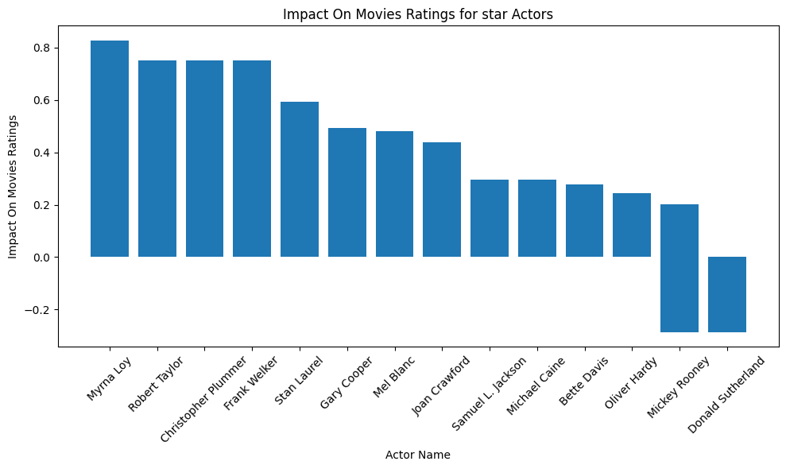

  
  

     An Evolutionary View on The Making of Good Films 🎬
    

    Analysis of various factors that lead to high Movies Rewiew
  

    

  

The impact of historical events on the influence of movies is undeniable. During periods of societal changes, films often reflect prevailing sentiments, collective values and historical events. As cultural norms shift with time, so do audience preferences and tastes in films. This influence reflects directly on the audience ratings of the stories that movie-makers seek to tell, giving us a unique lens to examine how people's perception of "a good film" has evolved over time.

# Introduction 

# Genres

# Topic

# Runtime

# Does star power translate to higher ratings? How has the impact of stars evolved over time in movie ratings?
The correlation between star power and ratings in the movie industry has long been a subject of fascination. Over the years, the influence of A-list actors and actresses on the success of a film has undergone a significant evolution. The captivating question persists: does the presence of renowned stars inherently lead to higher ratings? 
## Star-Studded Success: Unraveling the Influence of Actors on Movie Ratings
We want to understand the relationship between Star Actors and movies ratings, for that, we perform a Linear regression to see how each Actor Contributes to the Movie Ratings

Using only actors who played in at least 35 movies, by doing so , we isolate Actors with a real precense in the industry.

By keeping only coefficient with p-values <0.05 , we ensure that the data is Significant and that the results are meaningfull  : 

Before any further analysis, It's important to mention that the Linear regression had an R-squared of only 0.1 , meaning that only using actors explain quite badly the ratings of movies, However, the regression found 14 actors with a significant Impact on movies ratings. 

Movies featuring actors like Myrna Loy or Robert Taylor often experience a nearly one-point boost in their ratings due to their participation.

# Actors / Diversity 

# Conclusion
